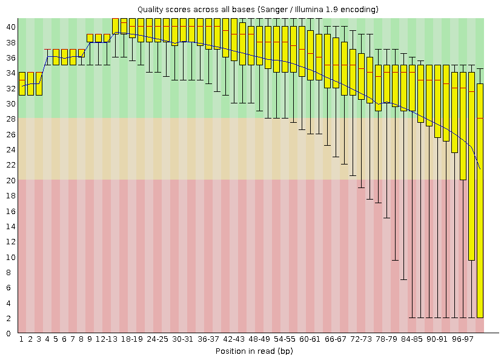
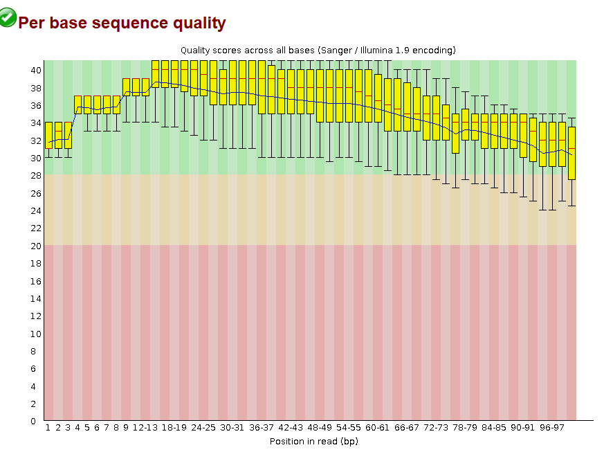

# RNA seq pipeline (Bash-linear)

In this method, I am going to use the most fundamental way of doing an RNA-seq analysis, the bash-way. We are going to run these bash commands one by one, and at the end, we are also going to automate it. Not fully though, because we still need to intervene during the QC stages


## Dataset
As already mentioned in the main README.md file, I am using RNA-seq data from the GEO dataset **[GSE37211](https://www.ncbi.nlm.nih.gov/geo/query/acc.cgi?acc=GSE37211)**, which investigates estrogen receptor signaling in parathyroid adenoma cells.

## Raw Data Download
To begin RNA-seq analysis, we first need to download the raw sequencing data from NCBI’s Sequence Read Archive (SRA). We use the `fasterq-dump` tool from the **SRA Toolkit**, which is faster than the older `fastq-dump`.

### Requirements

- SRA Toolkit (`fasterq-dump`) (My version was 
- Accession list of SRR IDs (`SRR_Acc_List.txt`)

The SRR accession list was retrieved from the [NCBI SRA Run Selector](https://www.ncbi.nlm.nih.gov/Traces/study/?acc=GSE37211) by exporting the "Accession List" for the study. This list was saved as `SRR_Acc_List.txt`, containing one SRR ID per line.

Use the `download_fastqc.sh` script, REMEMBER to make it executable (chmod +x)
```bash
#!/bin/bash
mkdir -p rawReads
while read id; do
    fasterq-dump "$id" --split-files --threads 4 -O rawReads/
done < SRR_Acc_List.txt
```
- `--split-files` separates paired-end reads into two files (`_1.fastq` and `_2.fastq`), which is required for downstream tools like STAR for paired-end alignment.
- `--threads 4` enables multi-threaded downloading, which basically means that your computer will use 4 CPU threads in parallel instead of 1, which is the default, to speed up conversion from SRA to fastq format.

## Read Preprocessing
This step includes initial quality assessment of raw reads, adapter and quality trimming using **Trimmomatic**, and re-evaluation of trimmed reads. Trimming improves alignment accuracy and reduces noise in downstream analyses.

### Tools Used

- `FastQC`: for quality assessment
- `MultiQC`: for summarizing FastQC results
- `Trimmomatic`: for adapter removal and quality trimming

### 1. Run FastQC on Raw FASTQ Files

```bash
mkdir fastqc_raw
fastqc raw_fastq/*.fastq -o fastqc_raw -t 4
```


Clearly, there's adapter contamination at the end of the reads, along with a drop in quality scores.  
That's expected, this kind of profile is common in Illumina paired-end data, especially near the 3′ end.

Now we use `Trimmomatic` to clean things up — remove adapters and trim those low-quality tails to get our reads ready for alignment.

### 2. Adapter removal with Trimmomatic
We use this `run_trimmomatic_all.sh` script to run the trim operations to all the samples

```bash
ADAPTERS="TruSeq3-PE.fa"
for file in rawReads/*_1.fastq
    sample=$(basename "$file" _1.fastq)
    echo "Processing $sample.."
        trimmomatic PE -threads 4 \
      raw_fastq/${sample}_1.fastq raw_fastq/${sample}_2.fastq \
      trimmed_fastq/${sample}_1P.fastq trimmed_fastq/${sample}_1U.fastq \
      trimmed_fastq/${sample}_2P.fastq trimmed_fastq/${sample}_2U.fastq \
      ILLUMINACLIP:$ADAPTERS:2:30:10 \
      SLIDINGWINDOW:4:20 TRAILING:20 MINLEN:36

    echo "Finished $sample"
done

echo "All samples processed."
```
A lot to unpack here. Let's start with `ILLUMINACLIP:$ADAPTERS:2:30:10`.

This part tells Trimmomatic to look for adapter sequences in the file we gave it (`TruSeq3-PE.fa`). These are the standard Illumina adapter sequences that sometimes get read into your data — especially when your fragment size is shorter than the read length.

Now the three numbers at the end (`2:30:10`) control how strict the adapter trimming is.

#### First: `2` — the max mismatches allowed in the seed
When Trimmomatic looks for an adapter, it starts by aligning a short initial stretch (called a "seed") from your read to the adapter sequence.  
This number (`2`) says: **you can have up to 2 mismatches between the read and the adapter in that seed region**.

#### Second: `30` — the palindrome clip threshold
This one’s specific to **paired-end reads**. Sometimes, when the actual DNA fragment is short, your reads can read right through the insert and into the adapter on the *other* end. Trimmomatic tries to detect this kind of adapter "overlap" by aligning the reverse complement of one read to the start of the other — a palindrome match.
This value (`30`) is a **match score threshold**. A higher number means **"be more confident before you trim."**

#### Third: `10` — the simple clip threshold
This handles the more basic case: there's a partial adapter stuck on the end of a read (like a tail). `10` is the **score threshold for clipping it**.
It’s more relaxed than the palindrome threshold because tail contamination is more common and easier to identify.

#### `SLIDINGWINDOW:4:20`
This tells Trimmomatic to scan the read with a 4-base window. If the **average quality** in that window drops below 20, it trims the read from that point onward.
It’s basically a smart way to cut off the 3′ tail when quality starts to tank — which we saw clearly in the FastQC plot.

#### `TRAILING:20`
This goes from the 3′ end and trims off any base with quality below 20, one by one, until it hits something good.
Think of it as a final sweep for junky bases stuck at the end.

#### `MINLEN:36`
If, after trimming, a read ends up shorter than 36 bases, it’s discarded.
Reads that short usually don’t align well or uniquely, so better to drop them.

### 3. Run FastQC on Trimmed FASTQ Files
Now that we have removed the adapter and contaminants, it's time to perform the Quality control again, We use a similar method as before.
```bash
mkdir trimmed_fastqc
fastqc trimmed_fastq/*.fastq -o trimmed_fastqc -t 4
```



The adapter contamination is gone. The low-quality tail at the 3' end is mostly cleaned up. There’s still a slight quality dip after ~85 bp, but nothing that warrants additional trimming. This is well within an acceptable range for downstream alignment


## Reads Alignment and Quantification
Now that our reads are cleaned up, it is time to align them to the reference genome and count how many reads map to each gene.
We’ll use:
- `STAR` — a fast, splice-aware aligner that's widely used for RNA-seq, what's a splice-aware aligner, you might ask? It’s one that knows how to deal with **introns**. Unlike DNA-seq, RNA-seq reads often come from **spliced transcripts** — meaning parts of the reads can span across exon–exon junctions. A splice-aware aligner like STAR can handle that. It doesn’t freak out when a read maps partially to one exon and partially to another — it recognizes that’s normal in RNA-seq and aligns accordingly. Without this, you'd miss a huge portion of your data — especially if you're working with eukaryotes where splicing is the rule, not the exception.
- `featureCounts` — part of the Subread package, to assign mapped reads to genes

### STAR Mapping workflow
STAR works in two steps:

1. **Generate genome index files** (only once) In this step we must provide the reference genome sequence (FASTA file) and annotations (GTF file), from which STAR generates genome indexes used in the 2nd (mapping) step.
   ```bash
    mkdir -p star_index

    STAR --runThreadN 4 \
     --runMode genomeGenerate \
     --genomeDir $index_path \
     --genomeFastaFiles $fasta_path/genome.fa \
     --sjdbGTFfile $GTF_path/annotation.gtf \
   
     ```
   
2. **Map reads to the genome** using those index files


